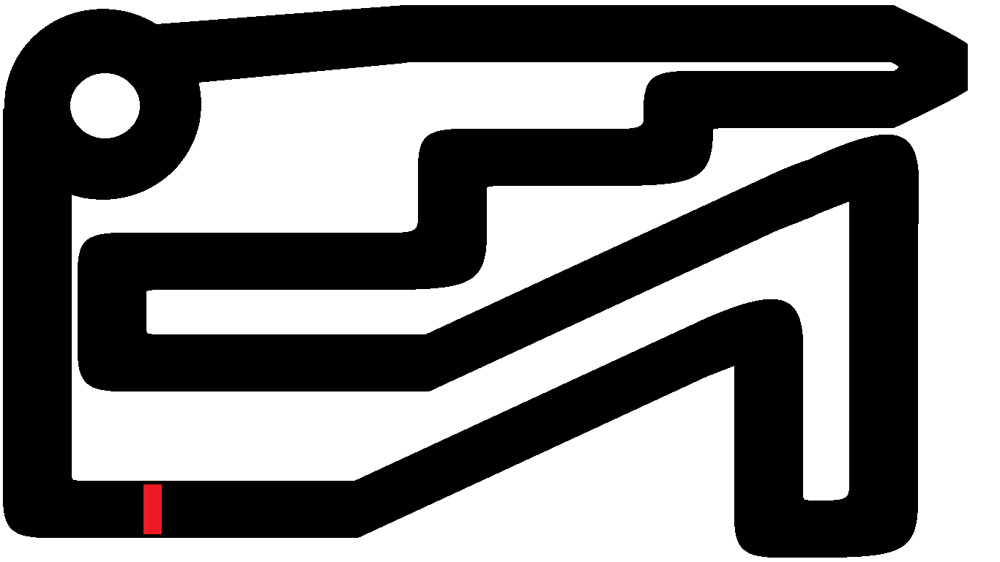

# Utilizing a Genetic Algorithm to Implement Self-Driving AI Car Simulation and Evaluating Performance


## Table of Contents
1. [Introduction](#introduction)
2. [Statement of the Problem](#statement-of-the-problem)
3. [Objectives](#objectives)
4. [Genetic Algorithms and Neat](#genetic-algorithms-and-neat)
5. [Running Simulation](#running-simulation)
6. [Results and Conclusion](#results-and-conclusion)
## Introduction<a name="introduction"></a>
Artificial Intelligence (AI) is at the forefront of technological innovation, and this paper explores the application of AI in the context of self-driving car simulations. The researchers delve into the concept of AI as a means of creating intelligent machines capable of mimicking human problem-solving and decision-making capabilities.
## Statement of the Problem<a name="statement-of-the-problem"></a>
The primary focus of this research is to determine the effectiveness of genetic algorithms, particularly NEAT, in training self-driving cars within a simulation. This has implications for real-world applications and can assist individuals with disabilities, making AI-driven technology more inclusive and practical.
## Objectives<a name="objectives"></a>
The research outlines three main objectives:

1. **Design a Simulation**: The researchers aim to design a simulation that employs a self-learning neural network to implement AI car behavior. Simulations are crucial for testing and ensuring the success, safety, and security of AI applications.
    
2. **Execute Simulations**: Running simulations is essential to evaluate the performance of AI. Multiple iterations and testing are conducted to assess the effectiveness of the genetic algorithm and neural network in self-driving car scenarios.
    
3. **Determine Effectiveness**: The final objective is to determine whether a self-learning neural network, specifically NEAT, is an effective approach for training AI to perform predefined actions. This evaluation will help compare NEAT to other topologies and assess its adaptability in the ever-changing landscape of AI.

## Genetic Algorithms and NEAT<a name="genetic-algorithms-and-neat"></a>
The paper highlights the significance of genetic algorithms, a method inspired by natural selection, in addressing optimization problems. Specifically, the researchers employ NeuroEvolution of Augmenting Topologies (NEAT) in their simulation. NEAT is a genetic algorithm-based approach for evolving artificial neural networks, starting with simple networks and gradually increasing complexity over generations.

## Running Simulation<a name="running-simulation"></a>
### Simulation Environment
The simulation environment will be designed using Pygame. A car object which comes as a image will be loaded along the with designed maps creating the environment. All subsequent functions are created within the main python program will be contained in one place along with the algorithm. The program will load the car, the map, and the configuration file.

#### The Car Object

The image shows how the car will look in the environment. The radar will be displayed using a function and is an efficient illustration of showing the 5 sensor nodes that will serve as the input nodes in the neural network. The nodes will check for. The cars actions depend on the 5 input nodes on what they encounter in the map and along with this the neural network has 2 output nodes which are aligned on what actions the car will do which is to either go left or go right. As the generations progress the better the neural network will determine efficient actions to be taken based on what it has encountered in the previous generations.

#### Maps
All maps are made using the Paint tool and there are 3 maps in increasing difficulty. This will show the difference on how the neural networks adapts to that map.


<h4 align="center"> Easy Map</h4>


<h4 align="center"> Normal Map</h4>


<h4 align="center"> Hard Map</h4>

#### Simulation Program
Before running the main python program adjust the code accordingly to the map that is to be simulated.

The things to consider are:
1. The starting position for each map
```python
        #starting position for Map1
        self.position = [290, 633]
        
        #starting position for Map2
        self.position = [280, 660]

        #starting position for Map3
        self.position = [205, 700]
```

2. The game map
```python
    #Change Map Accordingly
    game_map = pygame.image.load('Test_Map3.png').convert() # Convert Speeds Up A Lot
```

3. The display info
```python
        text = generation_font.render("Generation: " + str(current_generation), True, (0,0,0))
        text_rect = text.get_rect()

        #Map1
        text_rect.center = (654, 353)

        #Map2
        text_rect.center = (490, 250)

        #Map3
        text_rect.center = (400, 180)

        text = alive_font.render("Still Alive: " + str(still_alive), True, (0, 0, 0))
        text_rect = text.get_rect()

        #Map1
        text_rect.center = (654, 383)

        #Map2
        text_rect.center = (490, 280)

        #Map3
        text_rect.center = (400, 210)
```

## Results and Conclusion<a name="results-and-conclusion"></a>
The simulation was successfully implemented with cars, maps, and the NEAT algorithm. Minor errors were encountered during hard map simulations, resolved by reducing the car size from 48 to 38 pixels. The study's results are based on a single recorded simulation; gathering data from multiple simulations may yield consistent but variable results due to differences in starting conditions and species evolution. Conducting multiple simulations doesn't necessarily make the data unreliable. To see the data refer to the paper and here are the simulation videos for [easy map](https://drive.google.com/file/d/15jc2zD3t5u5jZk7R164K4FuWGs15_h5y/view?usp=sharing), [normal map](https://drive.google.com/file/d/1HEcrKpteoUhHBuwBqtMJQnD_OtfW59IJ/view?usp=sharing), and [hard map](https://drive.google.com/file/d/19GLrCVNO2PvQcHF7bOsZs1okujoH1pmi/view?usp=sharing)

It can be concluded that by using a genetic algorithm specifically NeuroEvolution of Augmenting Topologies (NEAT) that it is effective in training self-driving AI cars in a simulation. The algorithm displayed solutions for the given problems based on what it encounters in its given maps. This shows that this genetic algorithm is fast to learn and fast to optimize a solution for a complex problem.

##### References
1. Stanley and Miikkulainem (2002). “Efficient Evolution of Neural Network Topologies”. https://nn.cs.utexas.edu/downloads/papers/stanley.cec02.pdf 
2. CodeReclaimers, LLC (2018, October 13) NEAT-Python Documentation. https://neatpython.readthedocs.io/en/latest/config_file.html
3. Implementation of the NEAT Policy Manager (2019) https://www.divaportal.org/smash/record.jsf?pid=diva2:1281308